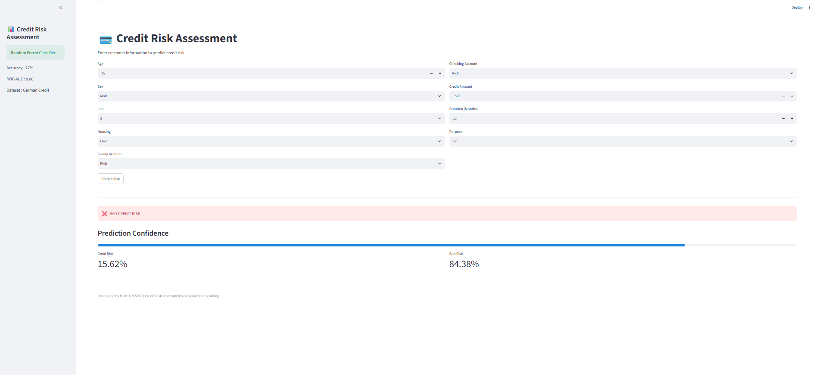
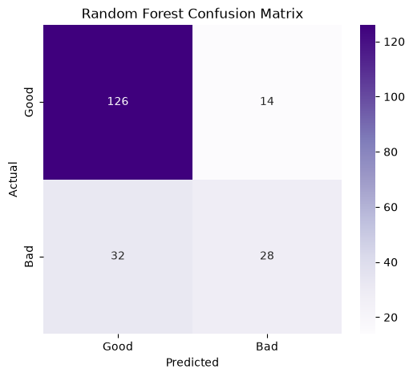
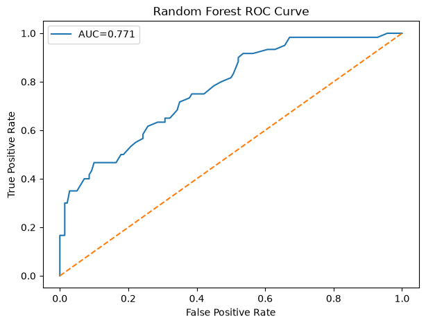
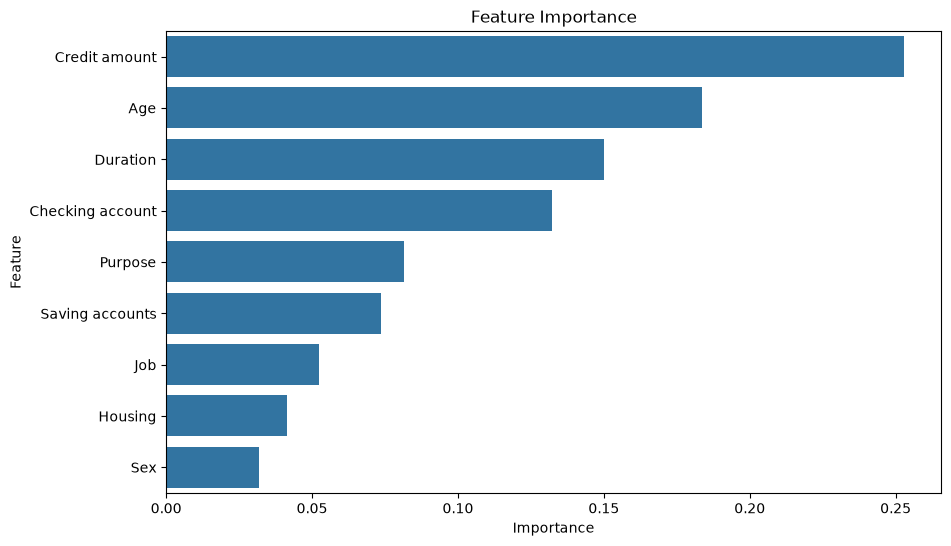

# 💳 Credit Risk Assessment using Machine Learning

## 📌 Project Overview

This project predicts whether a customer is a **Good Credit Risk** or **Bad Credit Risk** using Machine Learning.

The project follows a complete Data Science workflow, including:

- Data Cleaning
- Exploratory Data Analysis (EDA)
- Probability Analysis
- Statistical Inference
- Feature Engineering
- Machine Learning
- Hyperparameter Tuning
- Model Deployment using Streamlit

---

## 📊 Dataset

- Dataset: German Credit Dataset
- Total Customers: 1000
- Features: 9
- Target Variable: Credit Risk (Good / Bad)

---

## 🛠 Technologies Used

- Python
- Pandas
- NumPy
- Matplotlib
- Seaborn
- SciPy
- Scikit-Learn
- Streamlit
- Joblib

---

## 📈 Project Workflow

```text
Data Collection
      ↓
Data Cleaning
      ↓
Exploratory Data Analysis
      ↓
Probability Analysis
      ↓
Statistical Inference
      ↓
Feature Engineering
      ↓
Model Building
      ↓
Hyperparameter Tuning
      ↓
Model Evaluation
      ↓
Streamlit Deployment
```

---

## 🤖 Machine Learning Models

| Model | Accuracy | ROC-AUC |
|--------|---------:|--------:|
| Logistic Regression | 73% | 0.690 |
| Decision Tree | 70% | 0.629 |
| Random Forest | **77%** | **0.800** |

---

## ⭐ Feature Importance

| Rank | Feature |
|------|---------|
| 1 | Credit Amount |
| 2 | Age |
| 3 | Duration |
| 4 | Checking Account |
| 5 | Purpose |
| 6 | Saving Account |
| 7 | Job |
| 8 | Housing |
| 9 | Sex |

---

## 📷 Project Screenshots

### Dashboard



---

### Confusion Matrix



---

### ROC Curve



---

### Feature Importance



---

## 🚀 How to Run

Clone the repository

```bash
git clone https://github.com/your-username/Credit-Risk-Assessment.git
```

Go to the project directory

```bash
cd Credit-Risk-Assessment
```

Install dependencies

```bash
pip install -r requirements.txt
```

Run the Streamlit app

```bash
python -m streamlit run app.py
```

---

## 📁 Project Structure

```text
Credit_Risk_Assessment
│
├── data
├── models
├── notebooks
├── images
├── reports
├── src
├── app.py
├── requirements.txt
├── README.md
└── .gitignore
```

---

## 👨‍💻 Author

**Mohd Rashid **

B.Tech CSE (Data Science & AI)

---

## ⭐ If you found this project useful, consider giving it a star on GitHub.
